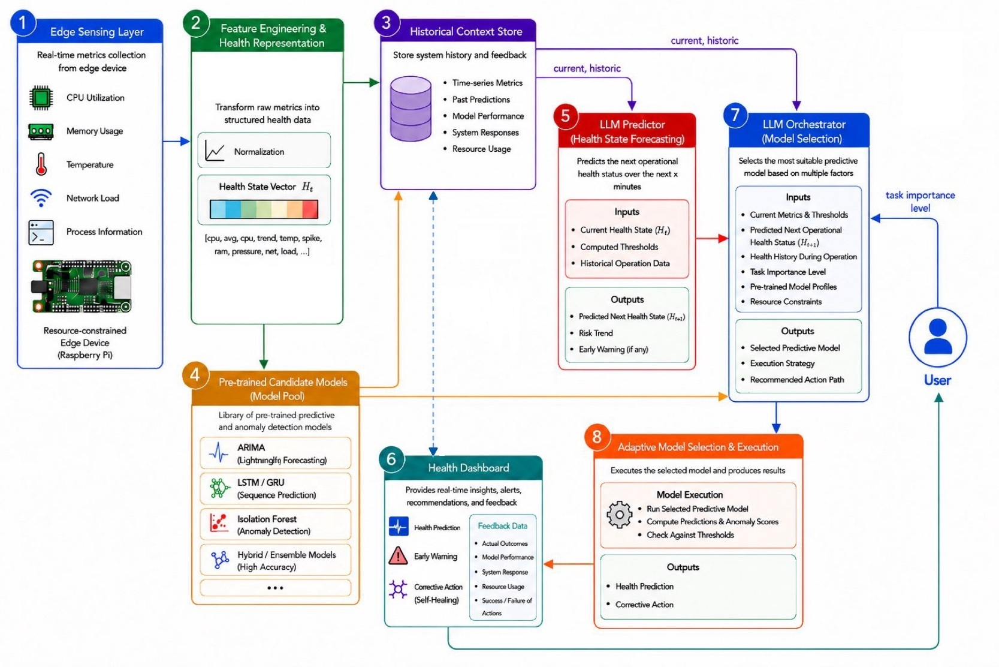

# Do-Or-Die: LLM-Driven Context-Aware Health Monitoring for Resource-Constrained Edge Devices
An LLM-driven, context-aware framework for real-time multivariate telemetry health monitoring and model orchestration on resource-constrained edge devices.

[MDPI Electronics](https://mdpi.com)

[Zenodo Dataset](https://zenodo.org)

[License: MIT](https://github.com/ioatzi/llm-edge-health-monitoring/blob/main/LICENSE)

Official implementation, evaluation configurations, and orchestration pipelines for the **Do-Or-Die** framework, originally published in **MDPI Electronics (Special Issue: Energy Efficient Computer Architecture for Edge Computing)**.
---

## 🚀 Framework Architecture


---

## 📑 Citations

### Academic Paper
```bibtex
@Article{electronics15163579,
AUTHOR = {Tzitzios, Ioannis and Dimara, Asimina and Petridou, Georgiana and Kostavelis, Ioannis and Krinidis, Stelios},
TITLE = {{LLM-Driven Context-Aware Health Monitoring for Resource-Constrained Edge Devices}},
JOURNAL = {Electronics},
VOLUME = {15},
YEAR = {2026},
NUMBER = {16},
ARTICLE-NUMBER = {3579},
URL = {https://www.mdpi.com/2079-9292/15/16/3579},
DOI = {10.3390/electronics15163579}
}
```

### Telemetry Dataset
```bibtex
@dataset{tzitzios_2026_zenodo,
  author       = {Tzitzios, Ioannis and Dimara, Asimina and Petridou, Georgiana},
  title        = {{Health Monitoring Raspberry Pi (RPi) Multivariate Telemetry Dataset}},
  month        = jul,
  year         = 2026,
  publisher    = {Zenodo},
  doi          = {10.5281/zenodo.20639458},
  url          = {https://zenodo.org/records/20639458}
}
```

---

## 🚀 Framework Architecture

**Do-Or-Die** introduces a novel dual-stage LLM orchestration mechanism that decouples device health state forecasting from resource-aware optimization loops on near-edge configurations.

1. **Stage 1 (Semantic Forecaster):** Analyzes multidimensional device health vectors (\(H_t\)) to estimate semantic health steps (9-levels: `SAFE` to `SOS`) 5 minutes into the future.
2. **Stage 2 (LLM Orchestrator):** Factors in the predicted health state, historical profiles, and user-specified Task Importance Levels (TIL) to dynamically select or toggle candidate local models (`Ridge`, `XGBoost`, `LightGBM`, `CatBoost`) or drop into emergency caching modes.

---

## 📊 Benchmarking & Verification Matrix
The table below showcases the performance improvements of our runtime orchestration model compared to static policies on the Raspberry Pi 5 over a 6-month period, as presented in our paper:

| Strategy | Avg. Accuracy (%) | Avg. CPU (%) | Avg. RAM (%) | Avg. Temp (°C) | Overall Edge Health Status |
| :--- | :---: | :---: | :---: | :---: | :---: |
| *Always Ridge* | 91.8% | 42.3% | 38.5% | 55.8°C | **SAFE** |
| *Always XGBoost* | 95.6% | 81.7% | 73.9% | 77.4°C | **CRITICAL** |
| *Always LightGBM* | 94.9% | 77.8% | 69.4% | 74.6°C | **WARNING** |
| *Always CatBoost* | 95.3% | 79.5% | 71.8% | 76.2°C | **CRITICAL** |
| **Proposed LLM Orchestrator** | **95.4%** | **64.8%** | **56.2%** | **66.5°C** | **SAFE** |

---

## 🤝 Contact & Open-Source Verification
* For questions regarding architectural schemas or system profiles, please open a GitHub Issue or reach out directly to the principal investigators listed in the manuscript.
